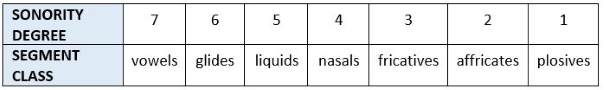
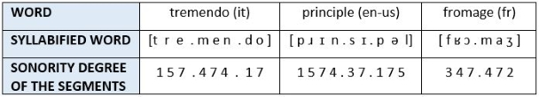

# Multilingual end-to-end ASR system with phonological syllables as subwords

The aim of this project is to build a multilingual ASR system trained with phonological syllables as subwords.

Syllables can be described broadly as linguistic units that represent sound organization patterns in human speech.   
They are relevant in speech production and perception and are considered a linguistic universal, meaning that they are found in all the documented languages, and languages that share a similar phonetic inventory have in common most part of their syllable inventory.  
According to the phonological definition, each syllable consists of at least a nucleus, namely an element characterized by a high degree of sonority (in most cases a vowel); the nucleus can be surrounded by less sonorant elements that constitute syllable onset and coda. The sonority within the syllable increases before the nucleus, in which the peak is reached, and decreases after it.

 

 

 

Syllables convey acoustic information, because the distribution of the segments represents the variation of energy in the signal.   Implementing such elements in the vocabulary on which the model is trained should therefore emphasize the association between each audio frame and its textual label and be beneficial for the recognition. 

 

To obtain syllables as subwords we need to build a custom tokenizer based on the class [Wav2Vec2PhonemeCTCTokenizer](https://github.com/huggingface/transformers/blob/v4.24.0/src/transformers/models/wav2vec2_phoneme/tokenization_wav2vec2_phoneme.py#L94) that works according to the main syllabification rules, the [Sonority Sequencing Principle](http://www.ai.mit.edu/projects/dm/featgeom/clements90.pdf) and the [Maximal Onset Principle](https://dspace.mit.edu/handle/1721.1/16397).

The dataset is automatically transcribed in phonemes to work on a phonological level. This is done through the tool [WebMAUS Basic](https://clarin.phonetik.uni-muenchen.de/BASWebServices/interface/WebMAUSBasic) provided by the the Bavarian Archive for Speech Signals of the Institute of Phonetics and Speech Processing of the Ludwig-Maximilians-Universität (München, Germany).

 

To build the ASR we [fine-tune](https://huggingface.co/blog/fine-tune-wav2vec2-english) the pre-trained model WavLM-large [(Chen et al., 2021)](https://arxiv.org/abs/2110.13900) on multilingual speech data extracted from the [Mozilla Common Voice](https://commonvoice.mozilla.org/it?gclid=Cj0KCQiA2-2eBhClARIsAGLQ2RlkVJtTFkEemoK3FvlpTxtFwuXvAHGOHadvXjzcbrx-R2Jw9eNdES8aAhcPEALw_wcB) dataset.  
The languages considered within this project are Italian, Spanish and French.  

The performance of the model is evaluated with two metrics: the Token Error Rate and the Phoneme Error Rate.
 
 
 

This repo contains:

* get_transcribe_data.py -> script to extract the corpus from Common Voice and get the phonologicasl transcriptions
* CSVprocessing.py -> script to process the transcriptions obtained from WebMAUS and add them to the dataset
* expMLhyb20.py -> script to fine fine-tune the model wavLM-large on our data
* CustomML_ITESFRPhoCTCTokenizer -> script containing custom tokenizer that acts according to syllabification rules
* tokenizerMLT_ITESFR_hybPhoSyl246 -> folder with multilingual syllabic vocabulary

